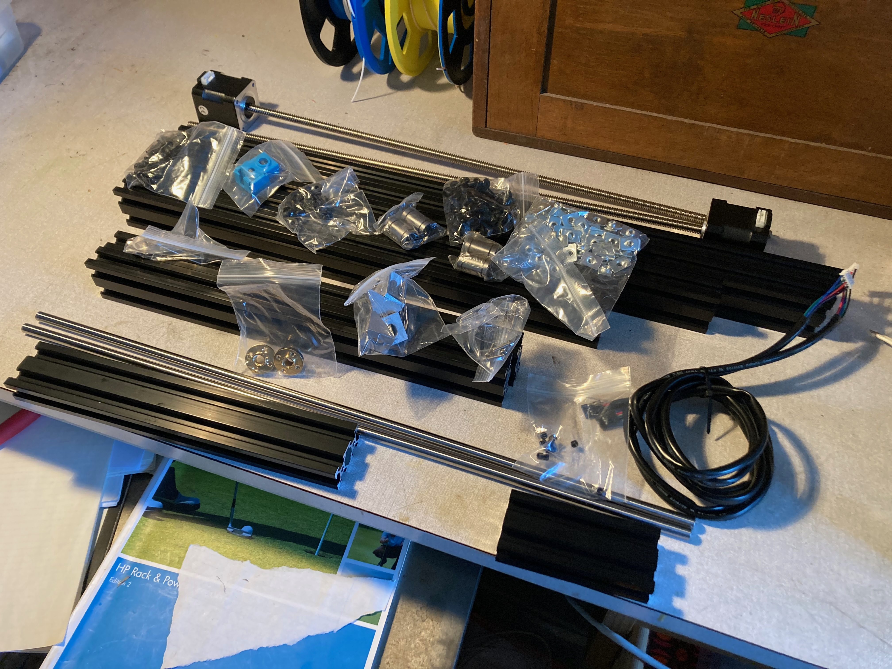

# The Printer Frame

__A Heap of Bits in 2020__

Like the Bear modifications for the Prusa MK3, the frame utilizes fairly typical 2040 aluminium extrusions with either 3D printed or metal brackets and braces. However, the lengths of most of the components are increased to allow for the greater width necessary to park the extruders away from the print bed. This allows each of the extruders to use the full bed area to print. The height is also increased.

When ordering the metalwork it is probably best to obtain the parts pre-cut to length as they need to be cut accurately. My frame components were supplied by [Ooznest](https://ooznest.co.uk) in the UK. I have no links with them other thna a satisfied customer. You will, of course, use your preferred supplier.

Here's a specification for the extrusions:

    X extrusion   570mm long - 2 required
    Y extrusion   331mm long - 2 required
    Z extrusion   415mm long - 2 required
    Top extrusion 490mm long - 1 required

I have found that even at this width, the extruders can get very close to one another and adding 5mm to the X and Top extrusions may make things a little easier space wise.

# Tapping the extrusions
Some of the extrusions may require tapping to take a screw into the ends of the component. In my case only the tops of the Z components required this and it was fairly short work with some grease, a sharp M5 tap and either a steady eye or a tapping guide.

If you have no idea what I'm talking about then your supplier may be able to tap the necessary extrusions prior to despatch.

I will try and include a photograph of the process.

I have found over the years that a decent set of Metric taps has been a useful inclusion in the 3D printing toolkit. I regularly use M3, M4 and M5. M2.5 and M2 occaisionally.

# Printed Parts
In addition you will need 10 off 90º Corner Joining Plates. Mine were 3D printed in PETG and have so far proved strong and resilient enough.

For most of the time, the printed part files can be obtained from @gregsaun's github repository [here:](https://github.com/gregsaun/prusa_i3_bear_upgrade)

Where I have developed different components, or where I use a different print file, they will be found in the STL folder - although they may be OBJ, 3MF or STEP format which are somewhat more robust. If you find issues with any files, please let me know,

So at this point its worth pointing out the flipping obvious, that in the grand 3D printing tradition, you will need access to a 3D printer to create parts for the the new 3D printer. Failing that a 3D print serivce may be availed upon to do the necessary.

The filename format for printed parts goes along the lines of:-

    partname_quantity_option_material

eg: Joining_plate_10off_Plain_PETG.stl

Generally, the materials I use are:- PETG for most of the structural components and a flex or TPU filament for some parts. Of course if you wish and are able to print good quality ABS or ASA components then the print files should be suitable. I tend to stay clear of PLA for structural work like this, although some of the newer PLA+ filaments may prove durable enough. If you ultimately decide to place the printer in an enclosure, then ABS should be preferred but I have used my Prusa clone with PETG parts in an enclosure for some years and it's not fallen apart - yet.

# Fixings
Fixings for the frame are M5 button head screws in various lengths along with M5 Tee nuts. the Bear Bill of Materials (BOM) should be pretty accurate for our needs, but its worth purchasing extras. If you only have enough, then one will invariably disappear behind a box in your workshop. If you purchase spares, then "The Law" says you will not need them. Head here for the [Bear BOM:](https://github.com/gregsaun/prusa_i3_bear_upgrade/blob/master/doc/bom.md)

  