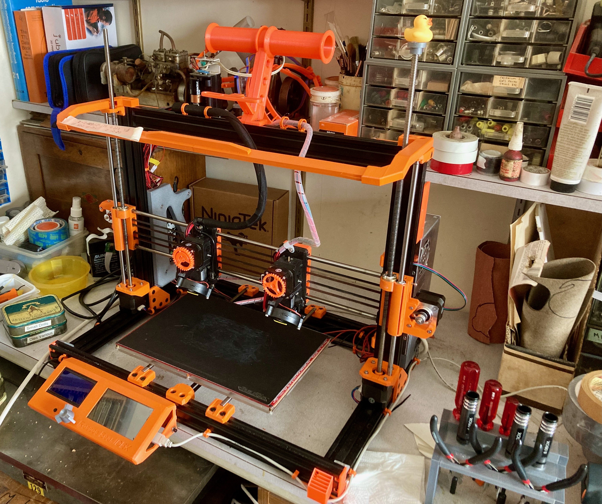

# Roscoe Bear IDEX 3D Printer

This is a remix of @gregsaun's excellent Prusa i3 Bear frame upgrade for the Prusa MK3S.

I made it wider, taller and use most of the original Bear plastic parts to create a much wider printer to make room for a 300mm x 200mm bed and two independant extruders. Print height is currently approximately 230mm, but I'm hoping to improve on that slightly without spending too much money.

# History
The design has been ongoing since 2017 or so and there is now a working prototype albeit lacking in certain features. The prototype has done useful work, but mainly as a single extruder printer :-)

Looking back at some of the design files, things have change greatly from the earliest concept.

# Electronics and Firmware
The printer currently runs Marlin 2.1.x and uses a BTT Octopus control board with TMC2130 and TMC2208 stepper drivers along with an ancient RepRap Full Graphics Display. A Raspberry Pi 3B+ acts as an Octoprint host and provides WiFi network connectivity and 4.3" touch screen with Octoscreen (or Octodash) control.

# Klipper as an option
Of course, Klipper firmware could be used but I feel there would be few advantages except perhaps that of input shaping which has some better capabilities than Marlin2 current has. I doubt there would be much speed advantage being a "bed-slinger" although firmware updates would be more convenient than loading a microSD card into the slot after compiling Marlin in VScode - Horses for Courses.

If you decide to go down the Klipper firmware route, I would be interested in hearing how you get on.

# IDEX Carriages
The main departure from the Prusa Bear is of course the X and U carriages (AKA: X and X2) which need to allow for the extra U (X2) stepper motor, belt and idler. For the moment this takes the form of  taller X carriage components to make room for it all. The printed components comprise the XmotorUidler, UmotorXidler, Xcarriage and Ucarriage. The carriages are formed from two printed parts encapsulating some LM8UU linear bearings in fairly standard Prusa fashion. The arrangement allows for fairly easy assembly of the extruders to the carriages and also allows some ealry testing with just the carriages fitted. This keeps things fairly clear to setup homing, parking positions and check for clearances.

# Extruders
The X and U extruders are basically Prusa MK3S but with the wiring harness exiting the top of the units - there's not enough room between all the belts to provide the Prusaesque wiring egress. The endstop sensor boards will need their pins bending carefully so the three pin dupont socket attaches vertically rather horiontally. The rest of the assembly is pretty much as per Prusa's build instructions for the MK3S extruder with the ball bearing switched filament sensor. I have not used the earlier MK3 optical sensor variant which sensed filament movement.

The left hand extruder carries a PINDA2 probe for Z homing. This currently runs successfully at 3.3 volts with the spring steel flexplate. The righthand extruder being offset in the Marlin config to allow for any differences. At the moment, this means that the printer will only work in IDEX mode 1 - Auto Park. Mirroring and Cloning (modes 2 and 3) will not be highly successful. A SuperPINDA could be utilized instead. The benefit being that it is temperature compensated and does not rely on a separate thermister setup.

Filament runout on both extruders is supported as per the Prusa setup. Just utilize a spare endstop port on the Octopus board - see Endstops

# Endstops
X, U and Y endstops are handled by the TMC2130 drivers (TMC2209 as an alternative). Z endstop is, as stated a PINDA2 probe.

The Endstop configurationis as follows

    X - Xmin (Stallguard)
    U - Xmax (Stallguard)
    Y - Ymin (Stallguard)
    Z - Zmin (PINDA2)
    E0 runout - Zmax
    E1 runout - Ymax

# Thermisters
The BTT Octopus board allowed for up to 5 thermisters. I have them as follows:

    T0 - Hotend 0
    T1 - Hotend 1
    T2 - Reserved for PINDA2 thermister
    T3 - Spare (Maybe for ambient sensor one day)
    TB - Heated Bed

# Heated Bed
The heated bed is a generic 24 volt 300mm x 200mm MK2-B (I think) with a BuildTak flexplate print surface form [3DJake](https://www.3djake.uk)

# Lighting
The Roscoe uses a string of NeoPixels arranged on a bracket above the bed. There is good Marlin support and only one pin is required from the control board. Indeed the BTT Octopus board has a dedicatd NeoPixel pin. All thast is required is a strong 5V supply to power it. I use a cheap eBay buck converter set to slightly about 5 volts. Marlin provides printer events to generate various colours as the printer heats up and successfully completes a job. But this only works when printing from the SD card at the moment. From Octoprint you can just set an appropriate code in the Custom G-code routines to turn the lights on, off and different colours if you wish. Manual control via the menu is also available.

# Work To Do
1. Height adjustment for the U carriage and extruder so IDEX modes 2 and 3 can be used.

2. Purge buckets - or a far more reliable purge tower control to improve multi material print quality.

3. Move to Prusaslicer from Cura to improve print quality and simplify configuration - which requirest the next item:

4. Twin part fan control which - Prusaslicer doesn't generate - However, using a post process python script sensible part cooling fan control is available. 

5. Shorten the height of the X and U carriage to increase the available print height.

6. Switch to a textured PEI sheet from the exisitng BuildTak setup

7. Finalize the Marlin2 config files.

# Alternatives
1. Control board could be a FYSETC Spider board - the Roscoe IDEX requires seven stepper motors to fully enable twin extruders and two independant Z motors. I did originally use an MKS RUMBA32 clone, but this only has support for six steppers and you have to do without the twin Z steppers and automatic gantry levelling. However this can be hacked reasonably well with a gcode script if a RUMBA32 or other six stepper board is all you have.

2. Stepper drivers could be TMC2209 for Stallguard on X, U and Y axis with TMC2208 for the extruders and Z motors. Although TMC have moved on now with driver options, the 22xx series drivers are more than adequate for the motor current requirement. You could always modify the endstop arrangement to something more tradiitonal if that is you require. There's nothing wrong with A4988 and microswitch endstops. But I do like the quietness of the TMC drivers. You can hear the bearings squeak when they dry out.

3. Heated bed - In order to keep the weight down I have used a lightweight PCB heated bed with a flexible spring steel sheet system carrying a BuildTaK print surface. i originally intened to fit an aluminium bed carriage. Suitable laser of waterjet cut. But I started building the printer shortly before the first COVID lockdown in 2020 and getting special stuff made became quite difficult - as well as trvelling around the country to collect parts. So, my Roscoe Bear IDEX has an acrylic bed carriage. I printed out the DXF outline and stuck on a sheet of 5mm acrylic and got to work wiht drills and hack saw. It is of course a lot lighter than and equivalent aluminium carriage although I doubtit would work too well in an enclosed casing as it would warp when it got hot. Marlin's BiLinear Mesh Bed Levelling appears to work sufficienty well for the moment.

Of course a glass sheet and blue tape could be used if that is your preference but will increase the bed weight somewhat. Definitely a candidate for input shaping algorythims of some sort.

My favourite, especially for PETG is a textured PEI surface which will be a future upgrade, once I find one - Maybe when the BuildTak surface wears out.

4. Extruder options are of course to use the E3D Revo 6 hotend or with some work, a Voron Stealthburner hotend with Clockwork 1 or 2 extruder and blingie RGB LEDs in it. - up to you really. There is a lot of work involved in getting the Stealburner to fit onto the exisitng carriage arrangement though.

5. Many other ideas as they occur.

# Summary 
This is very much a work in progress and is a long way behind things like the BCN3D Sigma and Voron IDEX work that is going on. As a "bed-slinger" its is never going to be as fast as either of the above, but is a fairly simple build from a frame point of view. The Prusa extruders are fairly easy to build and maintain and there's plenty of life left in the E3D V6 ecosystem. Especially with the new innovative Revo 6 nozzles.

If you have questions or ideas, please contact me.
